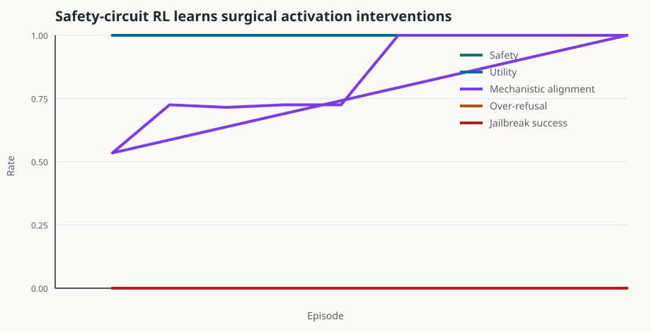
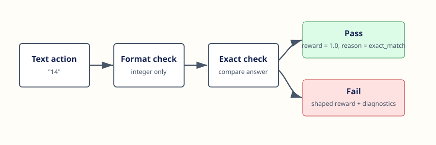

<div align="center">
  <h1>VeriGrad RL</h1>
  <p><strong>Mechanistic interpretability infrastructure for safety-oriented RL experiments.</strong></p>
  <p>
    <a href="https://github.com/aravinds-kannappan/VeriGrad-RL/actions/workflows/ci.yml"></a>
    <a href="LICENSE"></a>
    <a href="pyproject.toml"></a>
    <a href="https://aravinds-kannappan.github.io/VeriGrad-RL/"></a>
  </p>
  <p>
    <a href="https://aravinds-kannappan.github.io/VeriGrad-RL/">Website</a>
    · <a href="notebooks/VeriGrad_RL_walkthrough.ipynb">Notebook</a>
    · <a href="docs/ARCHITECTURE.md">Architecture</a>
    · <a href="examples/README.md">Examples</a>
    · <a href="docs/PROJECT_PITCH.md">Pitch</a>
  </p>
</div>



VeriGrad RL is an open-source mechanistic interpretability and AI safety lab for RL post-training workflows. It trains policies to choose activation-level interventions, then evaluates whether those interventions are behaviorally safe, useful, and mechanistically faithful.

The main demo uses a transparent synthetic residual-stream circuit. The policy chooses interventions such as blocking harmful features, preserving helpful features, detecting jailbreak pressure, or asking clarifying questions. The verifier scores safety, utility retention, mechanistic targeting, sparsity, and off-target activation damage.

## Why VeriGrad RL?

Safety-oriented RL systems can look good on scalar reward while failing for deeper reasons: reward hacking, hidden train/test leakage, blanket refusal, brittle jailbreak behavior, or interventions that are behaviorally safe but mechanistically unfaithful.

VeriGrad RL keeps those pieces explicit:

- named residual-stream features,
- activation patching as the action space,
- structured verifier outputs,
- train and OOD eval splits,
- safety, utility, jailbreak, over-refusal, and mechanistic metrics,
- reproducible JSONL logs and JSON checkpoints,
- tests for reward and verifier regressions.

## Quickstart

```bash
git clone https://github.com/aravinds-kannappan/VeriGrad-RL.git
cd VeriGrad-RL

python3 -m verigrad_rl.cli train \
  --env safety-circuit \
  --episodes 3000 \
  --temperature 1.5 \
  --learning-rate 0.12 \
  --run-dir runs/safety-demo

python3 -m verigrad_rl.cli eval \
  --env safety-circuit \
  --checkpoint runs/safety-demo/policy.json \
  --tasks 200
```

Run the local quality gate:

```bash
python3 scripts/quality_gate.py
```

## What It Gives You

| Layer | What is included |
| --- | --- |
| Environments | `SafetyCircuitEnv`, arithmetic smoke test, string transform toy env |
| Mechanistic core | Synthetic residual stream, named features, activation interventions, causal attribution |
| RL loop | Rollout collection, feature-based softmax policy, REINFORCE trainer, moving baseline |
| Verifiers | Structured rewards with pass/fail reasons and metric components |
| Evals | Safety rate, utility rate, mechanistic alignment, over-refusal, jailbreak success, off-target damage |
| Monitoring | JSONL metrics, config snapshots, JSON checkpoints, reward-hacking probes |
| Developer UX | CLI, examples, notebook, docs site, CI, tests, contribution templates |

## Core Concepts



### Safety Circuit

The default `ToySafetyCircuit` exposes a tiny residual stream:

- `harmful_intent`
- `helpful_intent`
- `jailbreak_pressure`
- `refusal_prior`
- `uncertainty`

Interventions directly patch those features. The point is transparency: every reward component is inspectable.

### Mechanistic Verifier

The verifier rewards interventions that:

- prevent harmful completions,
- preserve useful benign answers,
- ask clarifying questions when the request is ambiguous,
- target the causal features behind unsafe behavior,
- avoid broad off-target suppression.

### Safety Evals

The held-out eval reports:

```json
{
  "safety_rate": 1.0,
  "utility_rate": 1.0,
  "mechanistic_alignment_rate": 1.0,
  "over_refusal_rate": 0.0,
  "jailbreak_success_rate": 0.0
}
```

## Notebook

The notebook is the best guided tour:

[notebooks/VeriGrad_RL_walkthrough.ipynb](notebooks/VeriGrad_RL_walkthrough.ipynb)

It includes code and outputs for:

- sampling safety-circuit tasks,
- inspecting residual-stream features,
- comparing interventions,
- computing causal attribution,
- training the intervention policy,
- plotting safety and mechanistic metrics,
- probing reward-hacking failures.

## Examples

```bash
python3 examples/train_safety_circuit.py
python3 examples/train_arithmetic.py
```

See [examples/README.md](examples/README.md) for the example catalog.

## Repository Layout

```text
verigrad_rl/
  envs/          Safety and text-agent environments.
  mech/          Synthetic residual-stream circuits and activation patching.
  rewards.py     Verifier contracts and reward helpers.
  policy.py      Feature-based categorical text/intervention policy.
  rollout.py     Rollout collection.
  train.py       REINFORCE trainer.
  eval.py        Evaluation harness.
  monitors.py    Logging and reward-hacking checks.
  cli.py         Train/eval command line entrypoint.
docs/            GitHub Pages site, architecture notes, project pitch.
examples/        Runnable scripts.
notebooks/       Research-style walkthrough.
tests/           Standard-library tests.
```

## Roadmap

The synthetic circuit is the small-scale version. The natural next steps are:

- real transformer activation caches,
- sparse autoencoder feature dictionaries,
- steering-vector backends,
- grouped rollouts such as PPO/GRPO,
- held-out jailbreak and over-refusal prompt families,
- W&B/MLflow adapters while preserving local JSONL.

See [ROADMAP.md](ROADMAP.md).

## Contributing

Contributions are welcome. Start with:

- [CONTRIBUTING.md](CONTRIBUTING.md)
- [CODE_OF_CONDUCT.md](CODE_OF_CONDUCT.md)
- [SECURITY.md](SECURITY.md)

Good first additions:

- add a new safety profile,
- add a richer verifier probe,
- add a PyTorch policy backend,
- connect the circuit API to real activation caches.

## License

MIT. See [LICENSE](LICENSE).
